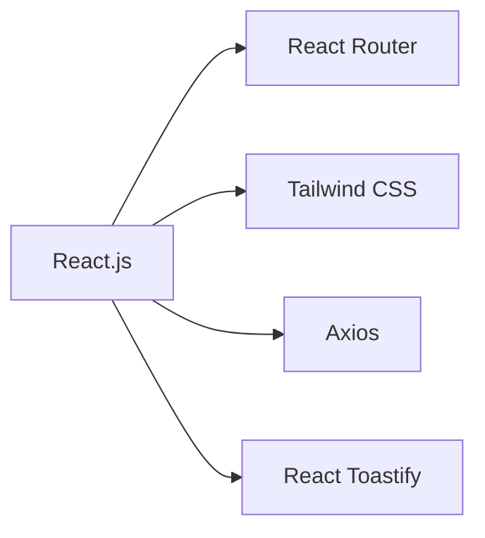
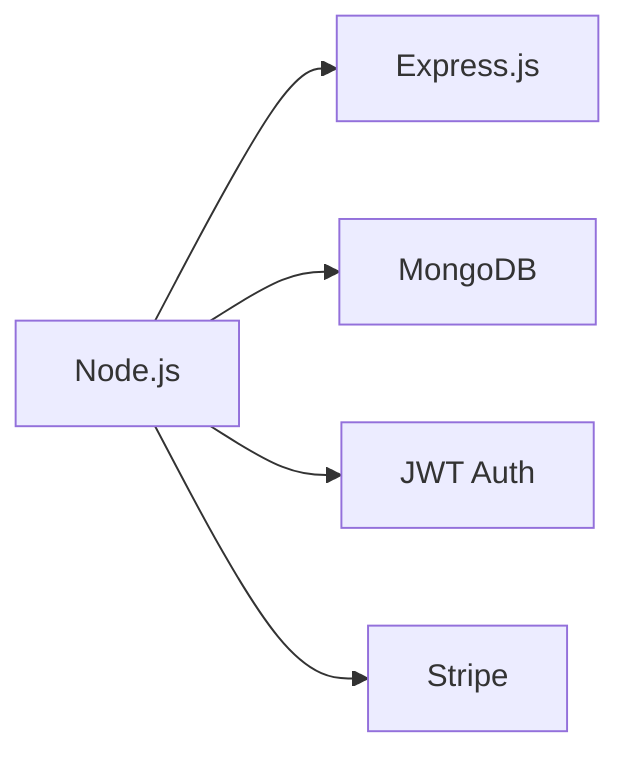

<div align="center">
  <h1 align="center">🍽️ MealMate</h1>
  <p align="center">Your Ultimate Food Delivery & Restaurant Management Platform</p>
  
  <p align="center">
    <a href="#features">Features</a> •
    <a href="#tech-stack">Tech Stack</a> •
    <a href="#getting-started">Getting Started</a> •
    <a href="#security">Security</a> •
    <a href="#contributing">Contributing</a>
  </p>

  
  
  
  
</div>

---

## 🌟 Features

<div align="center">
  <h3>Customer Experience</h3>
</div>

| Feature                 | Description                                                      |
| ----------------------- | ---------------------------------------------------------------- |
| 🍕 Restaurant Discovery | Browse through a curated list of restaurants with detailed menus |
| 🛒 Order Management     | Place, track, and manage your food orders in real-time           |
| 💳 Secure Payments      | Multiple payment options with Stripe integration                 |
| 🔐 User Authentication  | Secure login and profile management                              |
| 📱 Responsive Design    | Seamless experience across all devices                           |

<div align="center">
  <h3>Admin Dashboard</h3>
</div>

| Feature                  | Description                               |
| ------------------------ | ----------------------------------------- |
| 📊 Analytics             | Real-time insights and reporting          |
| 🏪 Restaurant Management | Complete control over restaurant profiles |
| 📝 Menu Management       | Dynamic menu creation and updates         |
| 📦 Order Processing      | Efficient order management system         |
| 👥 User Management       | Comprehensive user administration         |

## 🛠️ Tech Stack

<div align="center">
  <h3>Frontend</h3>
</div>



<div align="center">
  <h3>Backend</h3>
</div>



## 📁 Project Structure

```bash
MealMate/
├── Frontend/          # 🎨 Customer-facing web application
│   ├── src/          # 📦 Source code
│   └── public/       # 🌐 Static assets
├── Backend/          # ⚙️ REST API and server
│   ├── config/       # ⚙️ Configuration
│   ├── controller/   # 🎮 Route controllers
│   ├── middleware/   # 🔒 Custom middleware
│   ├── models/       # 📊 Database models
│   ├── routes/       # 🛣️ API routes
│   └── uploads/      # 📁 File uploads
└── Admin/            # 👨‍💼 Admin dashboard
    ├── src/          # 📦 Source code
    └── public/       # 🌐 Static assets
```

## 🚀 Getting Started

### Prerequisites

- Node.js (v14 or higher)
- MongoDB
- npm or yarn

### Installation

1. **Clone the repository**

   ```bash
   git clone https://github.com/yourusername/MealMate.git
   cd MealMate
   ```

2. **Install Frontend Dependencies**

   ```bash
   cd Frontend
   npm install
   ```

3. **Install Backend Dependencies**

   ```bash
   cd ../Backend
   npm install
   ```

4. **Install Admin Dashboard Dependencies**
   ```bash
   cd ../Admin
   npm install
   ```

### Environment Setup

Create a `.env` file in the Backend directory:

```env
MONGODB_URI=your_mongodb_uri
JWT_SECRET=your_jwt_secret
STRIPE_SECRET_KEY=your_stripe_secret_key
```

### Running the Application

1. **Start the Backend Server**

   ```bash
   cd Backend
   npm run server
   ```

2. **Start the Frontend Development Server**

   ```bash
   cd Frontend
   npm run dev
   ```

3. **Start the Admin Dashboard**
   ```bash
   cd Admin
   npm run dev
   ```

## 🔒 Security Features

<div align="center">
  <table>
    <tr>
      <td>🔐 JWT Authentication</td>
      <td>🔒 Password Hashing</td>
      <td>🛡️ Input Validation</td>
    </tr>
    <tr>
      <td>🌐 CORS Protection</td>
      <td>📁 Secure File Uploads</td>
      <td>🔍 Rate Limiting</td>
    </tr>
  </table>
</div>

## 🤝 Contributing

We welcome contributions! Please follow these steps:

1. Fork the repository
2. Create your feature branch (`git checkout -b feature/AmazingFeature`)
3. Commit your changes (`git commit -m 'Add some AmazingFeature'`)
4. Push to the branch (`git push origin feature/AmazingFeature`)
5. Open a Pull Request

## 📝 License

This project is licensed under the MIT License - see the [LICENSE](LICENSE) file for details.

## 📞 Support

For support, please:

- Open an issue in the GitHub repository
- Contact the development team
- Join our Discord community

<div align="center">
  <sub>Built with ❤️ by the MealMate Team</sub>
</div>
